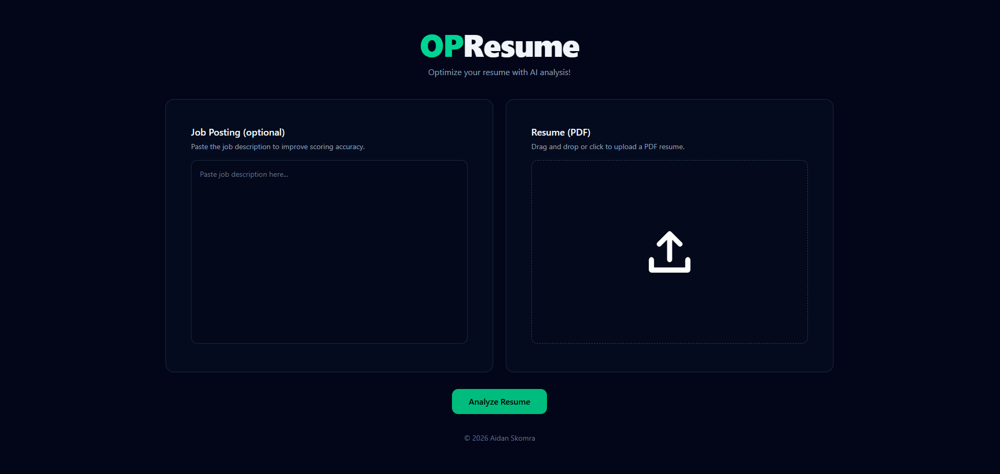
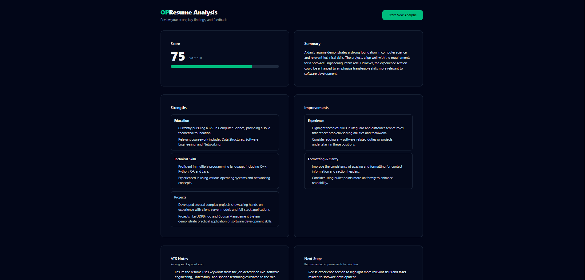

# OPResume


**OPResume** is a production-deployed web application that analyzes resumes using AI to simulate Applicant Tracking System (ATS) and recruiter-style screening. It provides structured feedback designed to reflect how resumes are evaluated in real hiring pipelines.

**Live:** https://opresume.ca  
**App Alias:** https://app.opresume.ca  
**API:** https://api.opresume.ca 

---

## What OPResume Does

OPResume allows users to upload a PDF resume (optionally alongside a job description) and receive a structured evaluation that includes:

- ATS-style score (0–100)
- Categorized strengths and weaknesses
- ATS parsing and keyword notes
- Clear, prioritized next steps for improvement

The system enforces **strict structured output**, ensuring responses are deterministicand reliable.

---

## Demo





*Complete resume analysis workflow: upload your resume and receive AI-powered ATS scoring with actionable feedback*

---

## Architecture Overview

OPResume is built as a decoupled frontend and backend system, deployed with production-grade infrastructure.

### Frontend
- **React + TypeScript (Vite)**
- **Tailwind CSS** with a reusable component system
- Client-side routing
- Animated score visualization
- Hosted on **Vercel**
- Canonical domain: `opresume.ca`
- `www` and `app` domains supported as aliases

### Backend
- **FastAPI (Python)**
- Hosted as a public web service on **Render**
- Exposed via `api.opresume.ca`
- Responsibilities include:
  - PDF parsing and validation
  - Input size and content enforcement
  - Request rate limiting
  - AI request orchestration
  - Structured response validation

### AI Integration
- OpenAI API
- Deterministic system prompts
- Responses validated against a strict schema to guarantee JSON correctness and prevent malformed output

---

## Production Domains

| Purpose | Domain |
|------|------|
| Canonical frontend | https://opresume.ca |
| App alias | https://app.opresume.ca |
| API | https://api.opresume.ca |

The root domain (`opresume.ca`) is the official entry point.  
Additional domains are also supported.

---

## Engineering Decisions

- **PDF handling**  
  Resumes are parsed using a read-only PDF parser with enforced limits on file size, page count, and extractable text.

- **Rate-limited public API**  
  Requests are rate-limited to protect a paid AI backend and prevent abuse of endpoints.

- **Explicit CORS allowlist**  
  Only owned frontend domains are permitted to call the API.

- **Environment configuration**  
  No hardcoded URLs or secrets; behavior is controlled entirely via environment variables.

- **HTTPS**  
  All services use managed SSL with custom domains.

---

## Environment variables

**Note:** Replace placeholder values with your actual configuration.

### Frontend (Vercel)

```env
VITE_API_URL=https://api.example.ca
```

### Backend (Render)

```env
OPENAI_API_KEY=your_openai_api_key
OPENAI_MODEL=gpt-4o-mini
CORS_ORIGINS=https://example.ca,https://www.example.ca,https://app.example.ca
OPENAI_TIMEOUT_SECONDS=60
MAX_PDF_MB=5
MAX_JOB_CHARS=5000
MAX_RESUME_CHARS=8000
RATE_LIMIT_DEFAULT=100/hour
RATE_LIMIT_ANALYZE=10/hour
```

Real values are stored securely in the deployment platform and are not committed to the repository.

---

## Local Development

### Backend

```bash
cd backend
python -m venv venv
source venv/bin/activate
pip install -r requirements.txt
uvicorn app.main:app --reload
```

### Frontend

```bash
cd frontend
npm install
npm run dev
```

The frontend runs on `http://localhost:5173` and communicates with the backend via the configured API URL.

---

## Deployment

- **Frontend:** Vercel (CI/CD from GitHub)
- **Backend:** Render Web Service
- **DNS:** GoDaddy
- **SSL:** Automatically managed

---

## Project Status

OPResume is fully deployed and production-ready.

All domains, security controls, and infrastructure reflect real-world deployment practices.

---

## Author

**Aidan Skomra**  
2025
